# FreshBakes.store — Functional Clone Spec (Mobile-First)

> **Purpose:** Give a coding agent everything needed to re-build the *functionality and user flow* of `https://freshbakes.store/` 100% accurately, **without** copying visual design / copy 1:1.
> Change the branding, colors, photos, and wording. Keep the interaction model, state machine, pricing logic, and checkout steps identical.
>
> **How to use this doc:** Read top-to-bottom, open the screenshots in order. Each section lists: what to build, exact behavior observed, edge cases, and which screenshot proves it.

---

## 0. Image Index (open these while building)

All images in `docs/freshbakes-clone/` :

### Desktop — shop
| # | File | What it proves |
|---|------|----------------|
| 01 | `01-homepage-desktop-full.png` | Full landing page structure, section order |
| 02 | `02-hero-desktop-viewport.png` | Hero: headline, CTAs, live stock counter, flavour carousel |
| 03 | `03-after-1-add-desktop.png` | After 1 add: card → stepper, `BOX 1 · 1/6`, CTA `CHECKOUT WITH 1 (ADD 5 MORE FREE)`, `YOUR ORDER 1` |
| 04 | `04-box-builder-partial-desktop.png` | Box builder panel layout, size pills `4 $22 / 6 $30 / 12 $54` |
| 05 | `05-box-full-6of6-desktop.png` | Full box: all Adds disabled, CTA `CHECKOUT · $30`, `BOX FULL. READY WHEN YOU ARE` |
| 06 | `06-your-order-drawer-desktop.png` | Clicking `YOUR ORDER` opens Checkout Step 1 modal (not a cart drawer) |
| 07 | `07-checkout-step2-details-desktop.png` | Checkout Step 2 form fields |
| 08 | `08-checkout-step3-payment-desktop.png` | Checkout Step 3 Card tab (disabled demo fields) |
| 09 | `09-checkout-cashapp-desktop.png` | Cash App tab: SEND TO / AMOUNT / REFERENCE + COPY buttons, `FB-3037` |
| 10 | `10-checkout-bank-desktop.png` | Bank tab: same pattern, `Set this in inc/config.php` placeholder |
| 11 | `11-order-confirmation-desktop.png` | Order confirmed screen, reference, upsell form, `BUILD ANOTHER BOX` |
| 12 | `12-faq-desktop.png` | FAQ collapsed, pricing block position |
| 13 | `13-faq-expanded-desktop.png` | FAQ expanded answers (transfer + multibox) |
| 14 | `14-soldout-notify-desktop.png` | Sold-out card style + toast `NOTED. WE WILL BAKE MORE MATCHA` |
| 15 | `15-checkout-delivery-desktop.png` | Delivery mode: zip/address/note, 3 runs, `$28` total ($22+$6 fee) |
| 16 | `16-reviews-desktop.png` | Reviews section: verified, timestamps |
| 17 | `17-pickup-delivery-desktop.png` | 3-step explainer: Build → Pick time → Pay |
| 18 | `18-pricing-footer-desktop.png` | Demo-sales pricing `$2,500` + footer columns |
| 19 | `19-multibox-desktop.png` | Multi-box: `BOX 1 · 4/4`, `BOX 2 · 0/6`, total `$52`, toast `BOX 2 STARTED` |

### Desktop — dashboard (`/dashboard/`)
| # | File | What it proves |
|---|------|----------------|
| 20 | `20-dashboard-desktop-full.png` | Today view: next order, stats, window-by-window, needs attention |
| 21 | `21-dashboard-orders-desktop.png` | Orders list + filters All/To make up/Ready/Unpaid/Collected |
| 22 | `22-dashboard-bakesheet-desktop.png` | Bake sheet: cookies → trays @12/tray, total 110 |
| 23 | `23-dashboard-menu-desktop.png` | Menu editor: stock stepper, name/desc/allergens/photo URL, Add/Remove/Save |
| 24 | `24-dashboard-insights-desktop.png` | Insights: sold, best seller, missed demand $, busiest windows, pay split |
| 25 | `25-dashboard-customers-desktop.png` | Customers list: 7 this week, initials avatar, order + value |
| 26 | `26-dashboard-money-desktop.png` | Money: settled/outstanding/fees saved/avg, waiting on payment |

### Mobile (390×844, touch) — **primary target**
| # | File | What it proves |
|---|------|----------------|
| 30 | `30-mobile-hero-viewport.png` | Mobile hero: no nav links, stacked CTAs, carousel full-width |
| 31 | `31-mobile-home-full.png` | Full mobile page: single-column cards, sticky bottom bar |
| 32 | `32-mobile-review-order-sheet.png` | Bottom-sheet `Your order`: Box 1·6, line item, `CHECKOUT · $30` |
| 33 | `33-mobile-checkout-step1.png` | Mobile checkout Step 1 full-screen modal |
| 34 | `34-mobile-build-grid.png` | Mobile build grid + inline box controls (`BOX 1 · 1/6`, `REVIEW`) |
| 35 | `35-mobile-faq-pricing.png` | Mobile FAQ accordion + pricing stacking |

---

## 1. Goals / Non-Goals

**Clone (must match functionally):**
- Box builder with live stock, sizes 4/6/12, multi-box, running totals
- Product card state machine (available → in-order stepper → sold-out → box-full disabled)
- Header order count + mobile sticky bottom bar + review sheet
- 3-step checkout modal: time slot → details → payment (4 methods + reference code)
- Delivery fee + address flow vs free pickup flow
- Order confirmation + reset + sold-out side effect
- Toasts + aria-live announcements
- FAQ accordion, flavour carousel, reviews list, 3-step explainer
- Dashboard 7 tabs (if in scope — at minimum document as phase 2)

**Do NOT clone 1:1:**
- Brand name, logo, photos, cookie names/descriptions, review text, marketing copy
- Exact colors/fonts/shadows. Inspiration only: heavy rounded corners (cards ~20-28px, pills fully rounded), soft cream background, dark brown CTA buttons, card-per-flavour grid.

---

## 2. Sitemap & Routes Observed

```
GET /                           # single-page shop (anchors: #top, #build, #pickup, #reviews, #pricing, #faq)
GET /dashboard/                 # back-office SPA with tabs: Today, Orders, Bake sheet, Menu, Insights, Customers, Money
tel:+15551240188                # footer phone
#top / #build / #pickup / #faq  # footer + header anchor links (Instagram/TikTok/Allergen sheet currently point to #top placeholders)
```

No login. `NO ACCOUNT NEEDED` is explicit under box builder. No separate product pages — everything happens inline on `/`.

---

## 3. Global Chrome

### 3.1 Top demo banner
- Full-width thin bar: `LIVE DEMO BY RESTAURANT DESIGN GUY. BUILD A BOX AND CHECK OUT, NOTHING IS CHARGED AND NO CARD IS TAKEN.` + link `$2,500 ALL IN → #pricing`
- Behavior: static, always visible above header. For your clone: replace with your own announcement bar component (dismissible optional, but keep the “demo / no charge” pattern if you run a demo mode).

### 3.2 Header (desktop vs mobile)
**Desktop (01,02):**
- Left: `FRESH BAKES` wordmark → `#top`
- Center nav: `BUILD A BOX → #build`, `PICKUP AND DELIVERY → #pickup`, `REVIEWS → #reviews`, `PRICING → #pricing`, `QUESTIONS → #faq`
- Right: `YOUR ORDER N` button (N = total cookies across all boxes). Opens checkout modal directly (06). Not a mini-cart popover.

**Mobile (30,31):**
- Only wordmark + `YOUR ORDER N`. No visible nav links, no hamburger observed — nav is hidden. You must add mobile nav (hamburger or anchor row) for usability; original omits it, don’t replicate that gap.
- Sticky bottom bar (always visible): left text `X COOKIES · Y BOX · $Z`, right button `REVIEW ORDER` (32,34). Opens `Your order` bottom sheet, *then* checkout. See §7.

---

## 4. Hero + Flavour Carousel

**Content (02,30):**
- H1: `Big cookies. Soft middles.` + sub: `Nine flavours, one batch a morning, and we stop when the rack is empty. Build a box of four, six or twelve, then collect it warm from the counter or take an evening delivery slot.`
- CTAs: primary `BUILD YOUR BOX → #build`, secondary `HOW PICKUP WORKS → #pickup`
- Live counters: big number `61 → 55…` + `COOKIES LEFT TODAY` (decrements on every add, increments? not observed on remove — verify), `★★★★★ 4.9 FROM 1,284 ORDERS`

**Carousel (critical interaction):**
- Shows `01 / 09 … 09 / 09`, Prev/Next arrows, large cookie photo, name, description, stock line (`1 LEFT TODAY` / `9 LEFT TODAY` / `SOLD OUT, BACK AT 7AM` + `GONE FOR TODAY, BACK AT 7AM`), `ADD TO BOX` button, 9 dot/label buttons below (`Brown butter chip … Oat and cinnamon`, `aria-pressed` on active).
- Behavior observed: auto-advances? It jumped from 01→07→04→09 etc. after each add (likely re-renders to next available or last interacted flavour). Clicking a dot jumps to that flavour. Prev/Next cycles 1-9 wrapping.
- `ADD TO BOX` in carousel adds 1 of currently shown flavour to active box (same as card Add).
- Sold-out flavours in carousel show disabled state, no Add (see Oat/Matcha: `GONE FOR TODAY`).
- Animation to replicate: crossfade/slide of image + text on change, dots fill, arrows round. Keep it lightweight (CSS transform + opacity, 250-350ms).

**Trust strip below hero:**
- 4 stats: `4.9 ★★★★★ 1,284 REVIEWS` / `19 min AVERAGE WAIT FOR A PICKUP BOX AT THE COUNTER` / `Same day DELIVERY ON EVERY ORDER PLACED BEFORE 9AM` / `Licensed COMMERCIAL KITCHEN, ALLERGENS ON EVERY FLAVOUR`

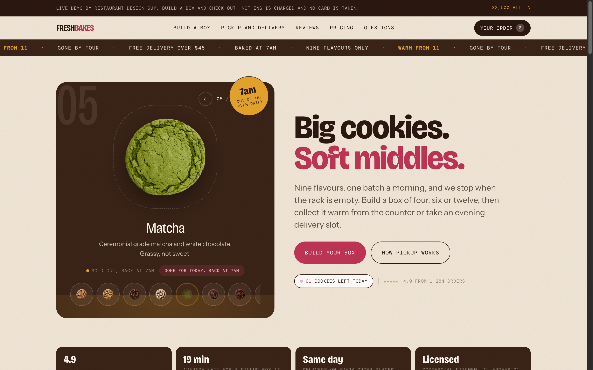
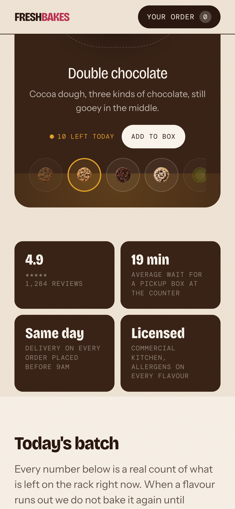

---

## 5. Today's Batch Grid (product listing)

**Layout:**
- Desktop: multi-column card grid (appears 2-3 cols). Mobile (34,31): single column stacked cards.
- Section header: `Today's batch` + `Every number below is a real count of what is left on the rack right now. When a flavour runs out we do not bake it again until tomorrow.`
- 9 flavours observed: Brown butter chip, Double chocolate, Biscoff butter, Red velvet, Matcha (sold out), Raspberry choc, Peanut butter cup, Toasted s'more, Oat and cinnamon (sold out).

**Card anatomy (available state):**
```
[01 number]
[photo]
[Name]
[Description 1-2 lines]
[Allergen pills: WHEAT MILK SOY / EGG / PEANUTS — uppercase small chips]
[N LEFT TODAY / ONLY N LEFT / 1 LEFT TODAY]
[Add button — small rounded “Add” bottom-right, aria-label="Add {Name} to your box"]
```

**Card state machine — replicate exactly:**

1. **Available:** shows `N LEFT TODAY` + enabled `Add`. Click → +1 in active box.
2. **In-order:** top stock line replaced by `ALL IN YOUR ORDER` (when remaining stock == quantity in order, e.g. Brown butter 1 left → after adding shows that) OR decremented `N LEFT TODAY` (e.g. Double 11→10→9). Control becomes stepper: `[− Remove one {Name}] [count] [+ Add another {Name}]`. Minus always enabled (unless box empty). Plus disabled when flavour stock exhausted (`disabled` attr observed on all full-box steppers).
3. **Sold-out:** entire card becomes a button: `{Name}, sold out today. Tap to tell us you wanted it.` No allergen pills, no Add. Click → toast `NOTED. WE WILL BAKE MORE {NAME}` (14) + increments missed-demand counter (see Insights §9). No cart change.
4. **Box-full:** when active box is full (e.g. 6/6), *all* `Add` / `Add another` buttons become `disabled` (05). Sold-out buttons remain clickable (for voting). Removing an item re-enables Adds.

**Stock copy rules:**
- `ONLY 1 LEFT` (hero + card), `ONLY 4 LEFT` (Raspberry at low stock), otherwise `{N} LEFT TODAY`.
- Header total `COOKIES LEFT TODAY` = sum of remaining across flavours (61 start → 55 after 6 adds → 54,53,52,51 during second session). Decrement immediately on add, before checkout.

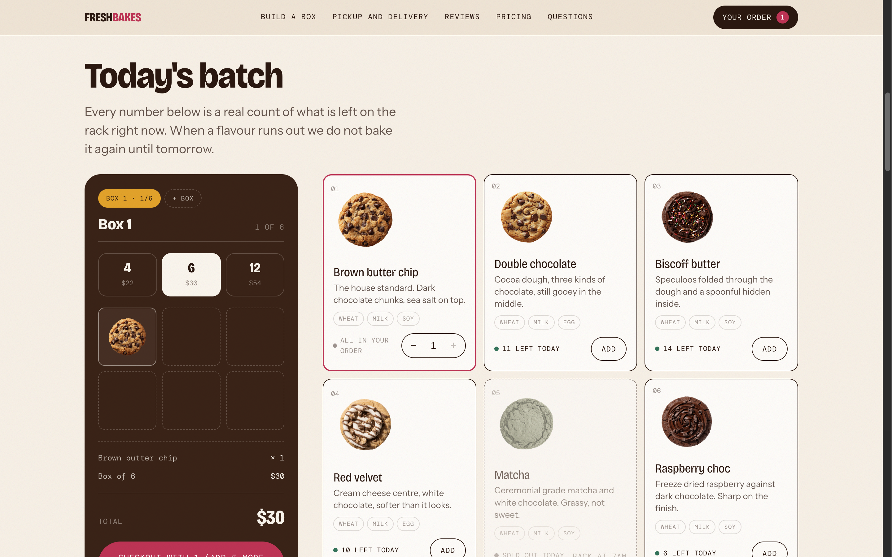
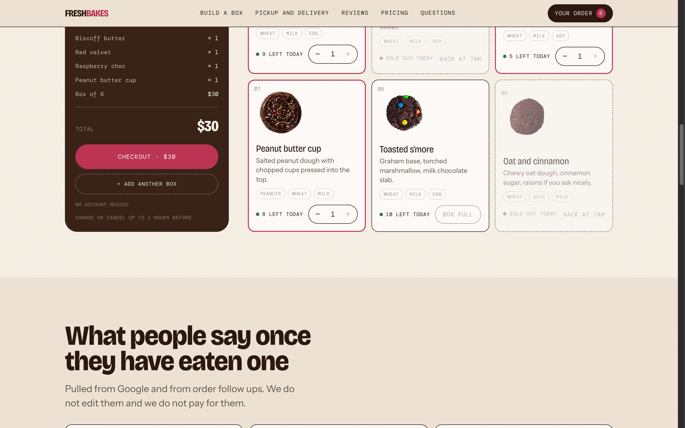

---

## 6. Box Builder Panel (core widget)

**Desktop position:** sticky/right column next to grid (04,05,19). **Mobile:** inline controls above grid (`4 $22 | 6 $30 | 12 $54`, `55 LEFT TODAY`, `BOX 1 · 0/6`, `+ BOX`, `REVIEW` disabled until >0) + sticky bottom bar (34).

**Elements:**
- Box tabs: `BOX 1 · n/size` (`aria-pressed` on active), `+ BOX` to add new box. After adding: `BOX 1 · 4/4`, `BOX 2 · 0/6` (19). Clicking a tab switches active box; Adds go to active box only.
- Title: `Box 1` / `Box 2`, progress `0 OF 6` → `6 OF 6` (or `0 OF 4` etc.)
- Size pills: `4 $22`, `6 $30`, `12 $54` (single-select, `aria-pressed`). Switching size mid-build observed: 6→4 resets progress denominator (`BOX 1 · 0/4`, `0 OF 4`, total `$22`). If box already has more items than new size? Not observed — define rule: changing size clears box or clamps? Recommended: changing size resets that box to empty (confirm with user). Document this decision.
- Line items: `{Name} × {qty}` per flavour in active box. Multi-box summary shows collapsed prior boxes: `Box 1 · 4 cookies $22` above active box editor (19).
- Totals: `TOTAL $X` = sum(box size prices) + delivery fee if delivery selected ($6). Observed: Box4 `$22` pickup; same box delivery step shows `$28` (15); 2 boxes (4+6) `$52` pickup (19: 22+30).
- CTA button state machine (exact labels to replicate with your copy):
  - Empty: `FILL THE BOX TO CONTINUE` disabled
  - Partial: `CHECKOUT WITH n (ADD k MORE FREE)` — e.g. `CHECKOUT WITH 1 (ADD 5 MORE FREE)`, `CHECKOUT WITH 5 (ADD 1 MORE FREE)`. Note: “FREE” means remaining slots incur no extra charge (fixed box price). This button *is clickable* in partial state (opens checkout anyway — we opened checkout with 1 item via YOUR ORDER; verify CHECKOUT WITH n also opens it).
  - Full: `CHECKOUT · $X` enabled (05) → opens Step 1.
- Microcopy under CTA: `NO ACCOUNT NEEDED` / `CHANGE OR CANCEL UP TO 2 HOURS BEFORE`
- Secondary: `+ ADD ANOTHER BOX` (creates next empty box, switches to it, toast `BOX 2 STARTED`)
- Live regions: two `aria-live="polite"` statuses. Toasts observed: `{Name} added. {n} of {size} in box {b}.`, `BOX FULL. READY WHEN YOU ARE`, `BOX 2 STARTED`, `NOTED. WE WILL BAKE MORE MATCHA`. Implement toast stack bottom-center (desktop) / above bottom bar (mobile), auto-dismiss ~3s, also update header count.

**Prices (hardcode as config):** `4=$22, 6=$30, 12=$54, delivery=$6`. Pickup free.


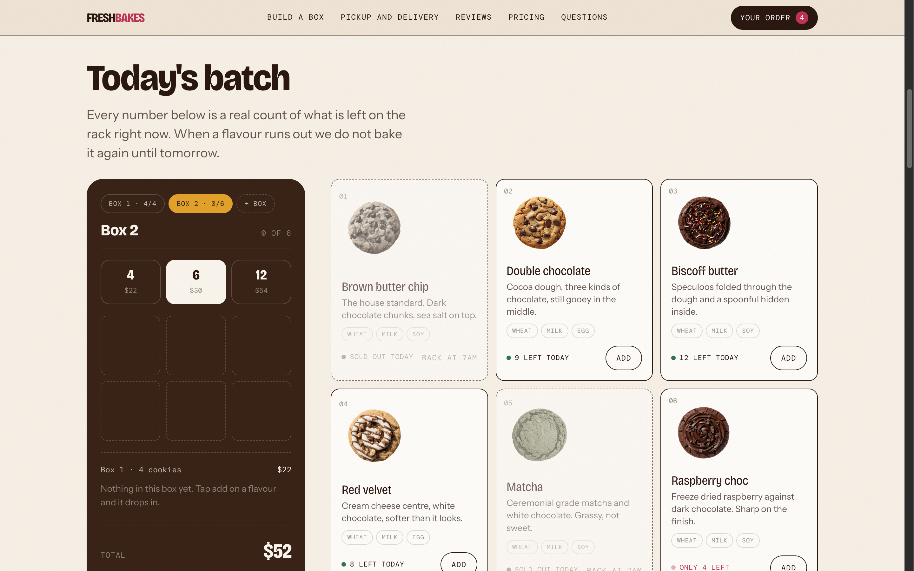
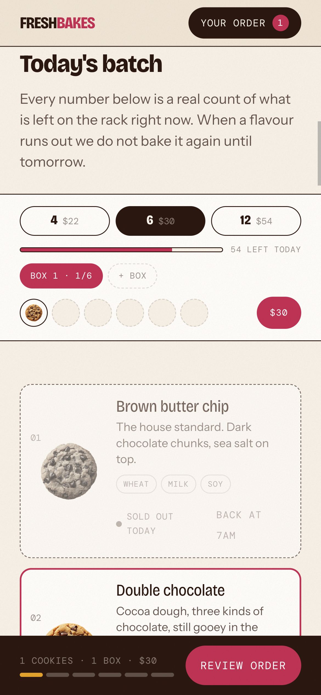

---

## 7. Mobile Review Sheet (differs from desktop)

- Trigger: sticky `REVIEW ORDER` or header `YOUR ORDER N` when N>0.
- UI (32): bottom-sheet modal `Your order`, close X, `Box 1 · 6`, `1 OF 6`, line `Double chocolate × 1`, `Box of 6 $30`, `+ ADD ANOTHER BOX`, `TOTAL $30`, primary `CHECKOUT · $30`.
- Behavior: sheet slides up, backdrop dims, body scroll locks, swipe-down / X / backdrop closes. `CHECKOUT` transitions to Step 1 modal (same sheet container, replace content, keep full-screen on mobile).
- Desktop has no review sheet — `YOUR ORDER` / `CHECKOUT` go straight to Step 1 modal (06). Replicate that divergence.

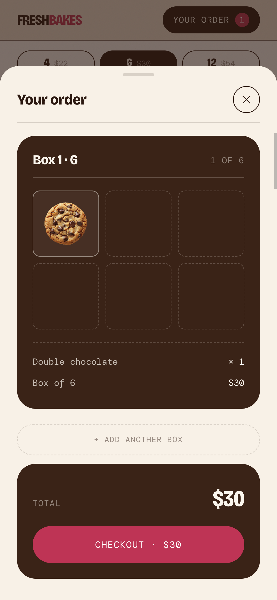

---

## 8. Checkout Modal — 3 Steps

Modal is `role="dialog" aria-label="Checkout"`, centered card on desktop, full-screen sheet on mobile (33). Close X always visible. Back links preserve state. No account, no redirect.

### Step 1 — How do you want it (06,15,33)
```
STEP 1 OF 3 · HOW DO YOU WANT IT
[Pickup FREE · 3 HOUR WINDOW (pressed)] [Delivery $6 · 3 RUNS A DAY]
CHOOSE A DAY: [22 TODAY (pressed)] [23 TOMORROW] [24 THU] [25 FRI]
Pickup branch:
  CHOOSE A 3 HOUR COLLECTION WINDOW: [11.00 – 2.00pm] [2.00 – 5.00pm] [5.00 – 8.00pm]
  Note: “Grey windows are already full. Boxes are made up at the start of your window, so the earlier you come the warmer they are.”
Delivery branch (15):
  YOUR ZIP CODE [textbox] + STREET ADDRESS [textbox] + DROP NOTE FOR THE DRIVER [textbox]
  CHOOSE A DAY (same 4)
  CHOOSE A DELIVERY WINDOW: [10.00 – 12.00] [12.30 – 2.30pm] [3.00 – 5.00pm disabled]
  Note: “Three runs a day between 10am and 5pm. A driver texts you when they are two stops away.”
[CONTINUE TO YOUR DETAILS]
```
- Rules: day defaults TODAY, window none selected initially (we selected 11-2 to proceed). Continue disabled until window selected? Observed Continue clickable after window press; assume validation: require day + window (+ zip/address for delivery, 9-zip allowlist — FAQ says 9 zips, outside → see §10). Disabled windows are greyed (`disabled` attr, e.g. 3-5pm delivery).
- Selecting Delivery immediately updates box builder TOTAL (+$6) even before continuing (observed $22→$28).

### Step 2 — Who is it for (07)
```
STEP 2 OF 3 · WHO IS IT FOR
NAME FOR THE ORDER [textbox]
MOBILE [textbox]
EMAIL [textbox]
ALLERGIES OR A NOTE FOR THE KITCHEN [textarea]
[CONTINUE TO PAYMENT]  [BACK TO TIME SLOTS]
```
- Validation (inferred, implement): name + mobile required, email format, note optional. We filled `Test Customer / 5551234567 / test@example.com / No nuts…` and continued successfully. Mobile likely US 10-digit, allow spaces. Show inline errors, keep values on Back.

### Step 3 — Payment (08,09,10)
```
STEP 3 OF 3 · PAYMENT
BOX 1 · 6  $30
{Brown butter chip ×1 … Peanut butter cup ×1} (all line items)
Pickup today, 11.00 – 2.00pm  (or delivery address + window + $6 fee line)
TOTAL $30
HOW DO YOU WANT TO PAY
[Card INSTANT (pressed)] [Cash App DEMO HANDLE] [Venmo @BIGSOFT] [Bank TRANSFER]
```
- **Card tab (08):** note `Card entry is switched off in this demo. On a live shop these are Stripe fields and take a real payment.` Disabled fields prefilled `4242 4242 4242 4242 / 04 / 28 / 123` + `Nothing is charged and no card details are collected or stored.` + `Card details go straight to Stripe and never touch this site. Nothing is charged until the box is made up, and you can cancel free up to two hours before your window.` CTA `PLACE ORDER · $30`.
  - For clone: integrate Stripe Elements (or Stripe Payment Link), never store PAN, capture after fulfilment if desired, same cancel policy copy (rewritten).
- **Cash App / Venmo / Bank tabs (09,10):** pattern identical:
  ```
  Send by {Cash App|Venmo|bank transfer} (H4)
  SEND TO  [$your-cashtag | @your-venmo | Set this in inc/config.php] [COPY]
  AMOUNT   [$30] [COPY]
  REFERENCE [FB-3037] [COPY]
  “On a live shop, the customer sends the amount with reference FB-3037 in the payment note, and the kitchen matches it in seconds. These handles are placeholders, so do not send anything.”
  [PLACE ORDER, PAY BY TRANSFER]  [BACK TO YOUR DETAILS]
  ```
  - Reference format `FB-XXXX` (4 digits, e.g. FB-3037). Generate per order, show on confirmation, include in dashboard + comms. COPY buttons use clipboard + `Copied` feedback.
- CTA behavior: `PLACE ORDER` → creates order, decrements stock permanently (Brown butter went sold-out after our order), clears cart (`YOUR ORDER 0`, `BOX 1 · 0/6`), opens confirmation.

### Confirmation (11)
```
Order confirmed (H3)
See you from 11.00am.
Give your name at the counter on today. We will confirm by text as soon as the transfer lands, usually within a few minutes.
[FB-3037] [Box 1 · 6 $30 + line items] [Pickup today, 11.00 – 2.00pm] [Bank transfer $30]
1 OF 3 SEPTEMBER SLOTS LEFT  ← demo-sales urgency (omit in real shop, or replace with your own)
Want this for your own shop? … dashboard … $2,500 … (demo-sales block — omit in real shop)
[YOUR NAME][YOUR BAKERY][YOUR EMAIL] [SECURE A SLOT WITH $1,250] NO PAYMENT TAKEN HERE…
[BUILD ANOTHER BOX] [BACK TO THE SHOP]
```
- `BUILD ANOTHER BOX` resets to empty builder at same scroll; `BACK TO THE SHOP` closes modal + scrolls top. Both reset checkout state but preserve stock depletion.
- For real clone: confirmation must show reference, slot, total, payment instructions (if transfer), SMS/email confirmation note, cancel-before-2h policy, order number.

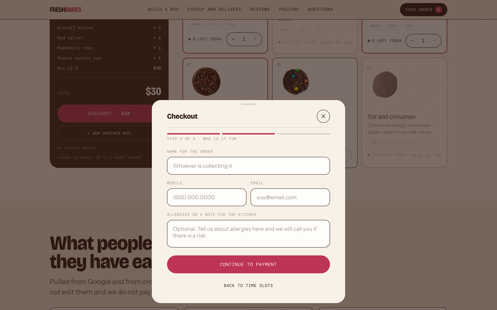
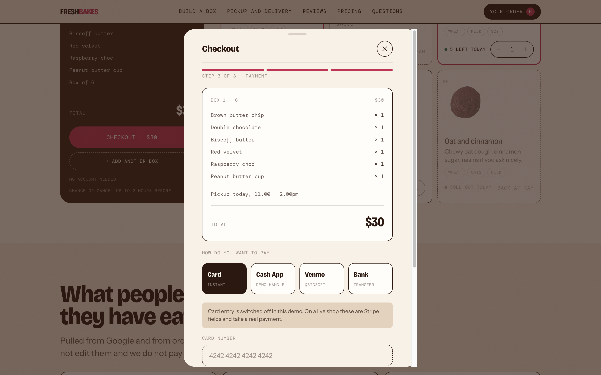
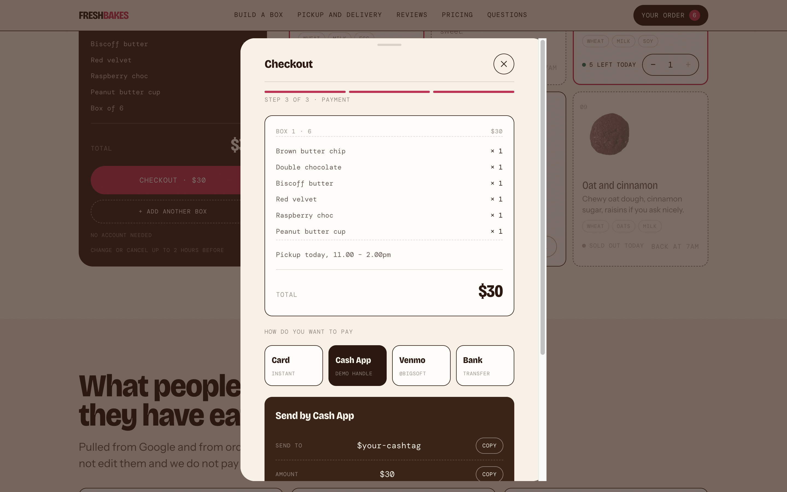
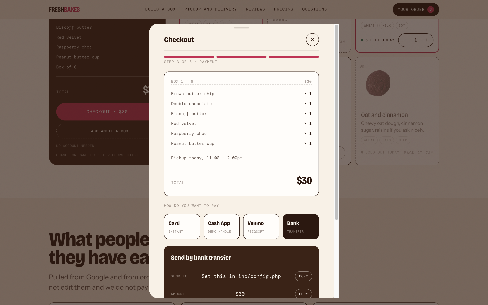
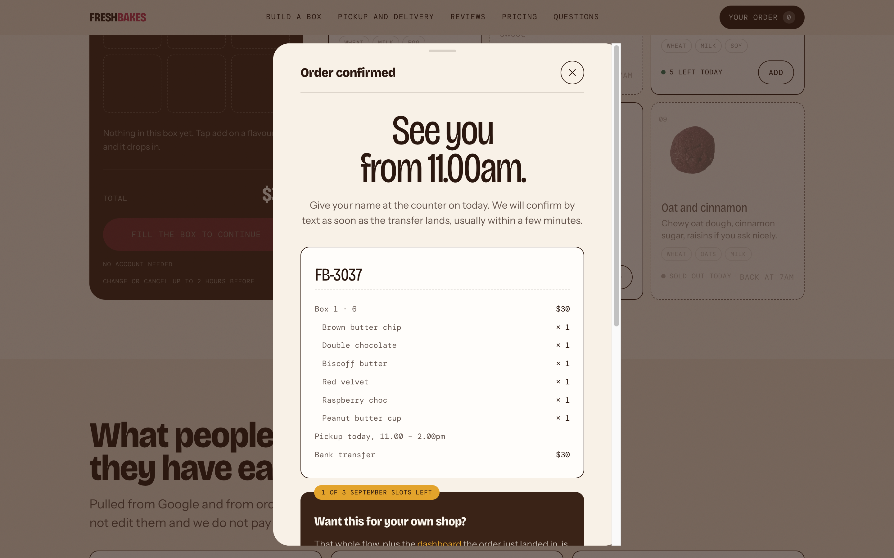
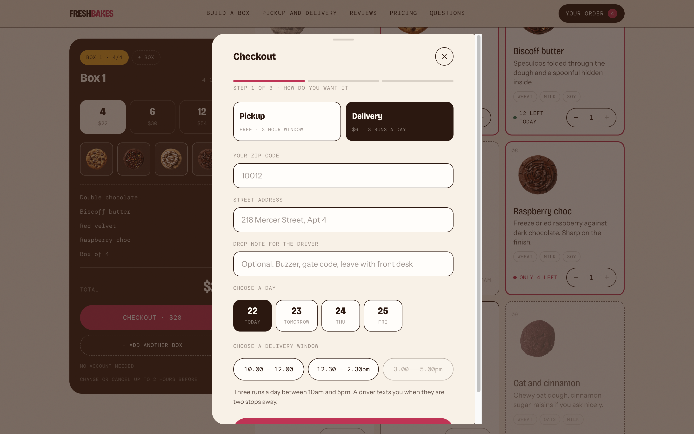
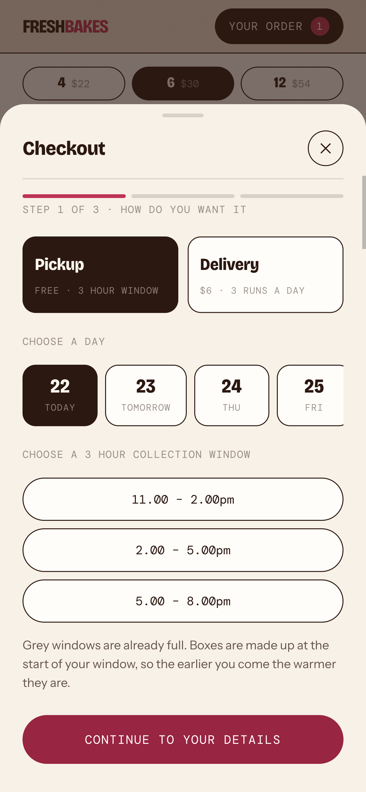

---

## 9. Other Shop Sections

### Reviews (16)
- Header `What people say once they have eaten one` + `Pulled from Google and from order follow ups. We do not edit them and we do not pay for them.`
- Cards: quote, `NAME · ✓ VERIFIED ORDER · 3 DAYS AGO` etc. 3 visible. For clone: carousel or grid, verified badge only for real orders, relative timestamps.

### Pickup/Delivery explainer (17)
- Header `Warm at the counter, or at your door` + `Pickup is free and you choose a three hour window… Delivery runs across nine zip codes on three runs a day.`
- 3 numbered cards: `1 Build the box / Choose four, six or twelve… Add a second box…` `2 Pick a time / Collect … 11am-8pm, or … three delivery runs 10am-5pm.` `3 Pay how you like / Card, Cash App, Venmo or bank transfer. Transfers get a reference code…`

### FAQ accordion (12,13,35)
- Header `Questions people actually ask`. Items (all `DisclosureTriangle +` expandable, first expanded by default):
  1. `How long do they stay soft?` → `Three days in a sealed container at room temperature, and they come back to life with eight seconds in a microwave. Do not refrigerate them, it dries the middle out.`
  2. `How does paying by transfer work?` → `Choose Cash App, Venmo or bank transfer at checkout and you get a handle and a reference code. Send the amount with that reference and the order is confirmed as soon as it lands, usually within a few minutes. Orders without a reference take longer to match.`
  3. `What are the allergens?` (content not expanded during test — implement allergen sheet modal/page)
  4. `Can I order more than one box?` → `Yes. Fill a box, then tap add another box and build a second one at any size. Everything is collected or delivered together in one slot.`
  5. `What happens if a flavour sells out after I order?` + 6. `Do you deliver outside the nine zip codes?` (expand to capture; assume: substitution/contact + no, 9 zips only)
- Behavior: single- or multi-open? Observed two open simultaneously (How-long + transfer + multibox all expanded), so multi-open allowed. Animate height (grid-template-rows or max-height), rotate `+` to `–`, update `aria-expanded`.

### Pricing / Footer (18) — demo-sales block
- `What a shop like this costs / One price… No retainer, no platform fee… you own all of it` `$2,500 / One payment. First year hosting included…` CTAs `TRY THE ORDERING FLOW → #build`, `SEE THE DASHBOARD → /dashboard/`, checklist `Everything in the base build` (8 bullets), `Let us build yours…` + `START A PROJECT → #build`.
- Footer: `FRESH BAKES`, `THE COUNTER 218 Mercer Street / Open 11am-8pm Tue-Sun / (555) 124 0188`, `ORDERS: Build a box / Pickup and delivery / Catering and large orders`, `ELSEWHERE: Instagram / TikTok / Allergen sheet`, `© 2026 FRESH BAKES · DEMO STOREFRONT`.
- For real clone: **omit** the $2,500 sales block; keep footer structure with your address/hours/socials.

---

## 10. Dashboard (`/dashboard/`) — Phase 2 Spec

Sidebar: `FB Fresh Bakes / 218 Mercer Street`, tabs `Today / Orders 7 / Bake sheet / Menu / Insights / Customers / Money`, helper `Kitchen mode — Put today's orders on a tablet in big type, for the bench. [Open]`, `View the shop → /`.

- **Today (20):** header `Today / Tuesday, September 22` + `Print bake sheet` + `Kitchen mode`. `NEXT OUT THE DOOR: Emily Carter / Box of 6 · #1052 / 7 STILL OPEN / Pickup 11-2 / Website / Paid $30 [Mark ready] [Kitchen mode]`. Stats: `TAKEN TODAY $166 / 7 orders`, `COOKIES TO BAKE 48 / 9 flavours on`, `HANDED OVER 0 of 7 / 7 still to make up`, `WAITING ON PAYMENT $130 / Chase these`. `The day, window by window — Who is coming and when`: groups `11-2 (2 orders · 18 cookies, 0 OF 2 COLLECTED)`, `2-5 (3·12)`, `5-8 (2·18)` with rows `EC Emily Carter Box of 6 #1052 Paid [Mark ready]` etc. `Needs attention — Only what will not sort itself out`: unpaid rows + `Note from Sarah Mendez: Nut allergy… [Open]` + `2 flavours are sold out: Matcha, Oat and cinnamon… [Restock]`.
- **Orders (21):** `All orders / 7 of 7 shown`, filters `All / To make up / Ready / Unpaid / Collected`, rows `EC Emily Carter Box of 6 #1052 Paid [Mark ready]` ×7.
- **Bake sheet (22):** `Every cookie ordered for today, counted into trays [Print]`, rows `{34 COOKIES Brown butter chip 3 trays at 12 a tray / 3 TRAYS}` etc., `TOTAL TO BAKE 110`. Trays = ceil(cookies/12). Matcha note: `1 turned away, bake extra`.
- **Menu (23):** `Shop menu and stock / Change it here and the shop updates when you save [Add a flavour]`, per flavour: `ON THE RACK TODAY [−] [stock spinbutton] [+]`, `NAME [text]`, `DESCRIPTION [textarea]`, `ALLERGENS, COMMA SEPARATED [text]`, `PHOTO URL [text]`, `FLAVOUR n [Remove]`; sold-out shows `Sold out on the shop` at 0. Footer: `This is a demo, so changes save to your own browser only. [Reset] [Save and update the shop]`.
- **Insights (24):** `COOKIES SOLD 316 in last 7 days / BEST SELLER Brown butter chip 68 / TYPICAL BOX 4 cookies across 88 boxes / REPEAT 38%`, `What sold this week — Every flavour, ranked (316 cookies)`: 1-9 with counts + % + advice (`Oat … sells a sixth of Brown… rewrite or give tray space…`), `Demand you missed — People who hit a sold-out flavour: $235 walked out… 47 people… (23 Oat $115 / 14 S’more $70 / 10 Matcha $50) → Bake more oat…`, `Busiest windows — Where to put staff: 34 × 11-2 / 58 × 2-5 / 41 × 5-8 → afternoon does more…`, `How they pay — Card 50% / Cash App 25% / Venmo 16% / Bank 9% → 50% by transfer saves ~$40 in card fees…`.
- **Customers (25):** `Customers / 7 this week`, rows `SM Sarah Mendez 1 order · Pickup 2-5 $76` etc. with initials avatars.
- **Money (26):** `SETTLED $166 / 5 orders / OUTSTANDING $130 / 2 / CARD FEES SAVED $3 on transfers / AVERAGE ORDER $42.29 this week`, `Waiting on payment — Transfers not landed yet`: `SM Sarah #1054 bank Pickup 2-5 $76 [Mark received]` etc.

Actions to implement: `Mark ready / Mark received / Restock / Print / Kitchen mode / Save menu`. Kitchen mode = big-type tablet view (not captured — build as large list of current window orders).

---

## 11. Data Model (suggested)

```ts
type BoxSize = 4 | 6 | 12;
const BOX_PRICES = { 4: 22, 6: 30, 12: 54 };
const DELIVERY_FEE = 6;

interface Flavour { id: string; name: string; desc: string; allergens: string[]; photo: string; stock: number; soldOutAt?: string }
interface Box { id: string; size: BoxSize; items: Record<flavourId, qty>; }
interface Order {
  ref: string; // FB-XXXX
  boxes: Box[]; fulfilment: { mode: 'pickup'|'delivery'; day: string; window: string; zip?: string; address?: string; note?: string };
  customer: { name: string; mobile: string; email: string; kitchenNote?: string };
  payment: { method: 'card'|'cashapp'|'venmo'|'bank'; total: number; status: 'paid'|'pending' };
}
```

Rules:
- `boxCount = sum(qty) <= size` (block Adds at == size).
- `orderTotal = sum(BOX_PRICES[size]) + (mode==='delivery' ? 6 : 0)`.
- Stock decrements optimistically on Add, permanently on Place Order; sold-out at 0 flips card to vote mode + increments `missedDemand[flavour]++`.
- Reference: `FB-${random 1000-9999, unique per day}`.
- No auth; persist cart + menu edits to localStorage (dashboard demo notes browser-only save).

---

## 12. Animations & Micro-interactions (replicate feel, not exact CSS)

- Carousel: slide/fade 250-350ms, dots animate, arrows scale on press.
- Add: button morphs to stepper; count pops; header count bumps; bottom bar (mobile) slides up; toast slides/fades in bottom-center; `aria-live` announces.
- Box tabs: underline/pill slides; progress `n OF size` counts; CTA label crossfades between states.
- Modal: desktop fade+scale 200ms; mobile slide-up sheet with backdrop; step transitions slide horizontal; Back preserves inputs.
- Accordion: height expand 250ms, `+` rotates 45deg.
- COPY: checkmark + `Copied` tooltip 1.5s.
- Full-box: button pulses once + `BOX FULL` toast; Adds shake if tapped while disabled (optional).
- Respect `prefers-reduced-motion`.

---

## 13. Accessibility Checklist

- All Adds/steppers have `aria-label="Add {N} to your box" / "Remove one {N}" / "Add another {N}"`, `disabled` where appropriate, `aria-pressed` on size/box/carousel dots.
- Checkout `role=dialog aria-modal`, focus trap, Esc closes (confirm if dirty?), focus returns to trigger, Step headings `STEP n OF 3`.
- Two `aria-live=polite` regions for toasts/counters; form labels visible + `aria-describedby` for hints; zip/mobile/email inputmodes + validation messages with `aria-invalid`.
- Contrast ≥4.5:1, touch targets ≥44px (critical on mobile Add/stepper/COPY), keyboard operable carousel + accordion (`DisclosureTriangle` pattern).

---

## 14. Agent Build Checklist (mobile-first order)

1. [ ] Scaffold routes `/` + `/dashboard/` (dashboard behind feature flag if needed), responsive tokens (rounded-2xl cards, pill buttons).
2. [ ] Header + mobile sticky bar + review sheet shell (empty states first).
3. [ ] Hero + carousel (mock 9 flavours) + trust strip.
4. [ ] Batch grid cards with 4-state machine + stock math + toasts/live regions.
5. [ ] Box builder: sizes, tabs, +BOX, totals, CTA state machine.
6. [ ] Checkout Step 1 (pickup + delivery branches, fee logic, window disabling).
7. [ ] Step 2 form + validation + back-persistence.
8. [ ] Step 3 payments (Card/Stripe + 3 transfer tabs with COPY + FB-XXXX ref) + Place Order.
9. [ ] Confirmation + cart reset + sold-out side effect + BUILD ANOTHER BOX.
10. [ ] Reviews + explainer + FAQ accordion + footer (your copy).
11. [ ] Dashboard 7 tabs + actions (or stub with mock data).
12. [ ] QA: fill 4/6/12 boxes, multibox totals, delivery $6, sold-out voting, mobile 390px flow end-to-end, keyboard + screen-reader pass, `prefers-reduced-motion`.

**Do not copy:** brand, photos, flavour names/descriptions, review quotes, $2,500 sales block. Replace with your client’s content.

---

## 15. Open Questions / Assumptions to Confirm

- Size change with items in box: currently resets to empty (observed 6→4 cleared to 0/4). Confirm: reset vs prorate vs block? Spec assumes reset.
- Partial-box checkout (`CHECKOUT WITH n (ADD k MORE FREE)`): opens checkout with partial box at full box price — confirm allowed (we verified via YOUR ORDER path; assume same for CTA).
- Delivery zip allowlist (9 zips) not captured — implement configurable list + error `We don’t deliver to {zip} yet — try pickup.`
- `What are the allergens? / What if flavour sells out after I order? / Deliver outside 9 zips?` answers not expanded — write your own from kitchen policy.
- Dashboard `Kitchen mode`, `Print`, order-status transitions (`Mark ready → Ready → Collected`) need backend; stub with local state for v1.

---

*Source: live exploration of freshbakes.store on 2026-09-22 (desktop 1440×900 + mobile 390×844 emulated touch). All behaviors above were clicked and screenshot-verified; labels quoted verbatim for functional fidelity — rewrite customer-facing copy for your launch.*
